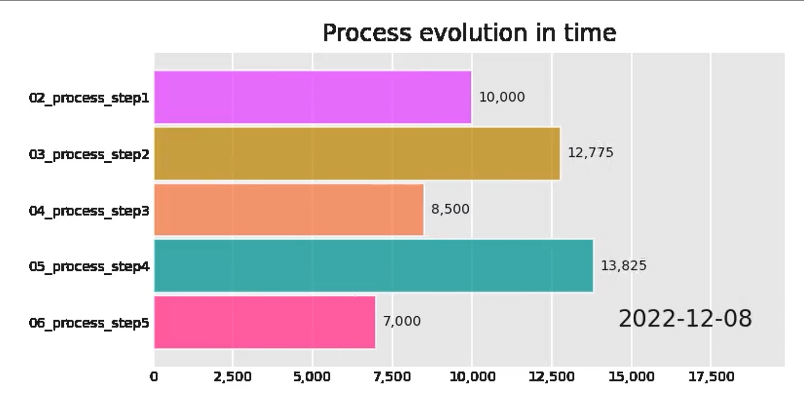
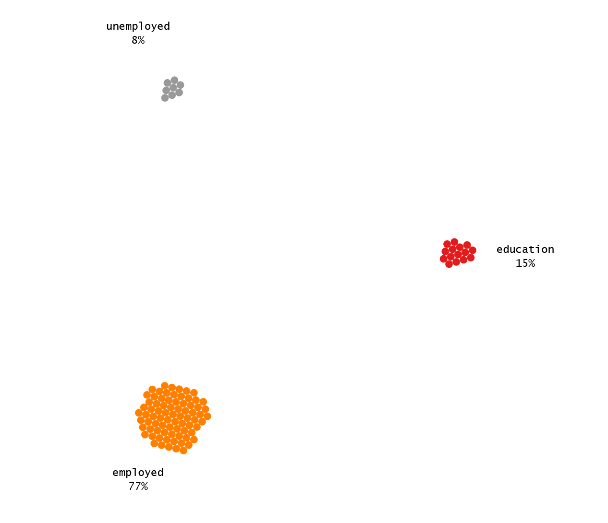
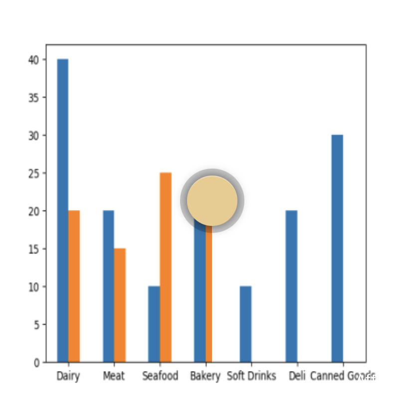

# fav_py_visualization
This repo features my favorite visualization made with Python.

You will find the following visualization techniques and examples (go directly to this content by clikcing on images):

<table width="100%" spacing="2" padding="2" BORDER="0">
  <TR>
    <td width="150">
       
      Bar Chart Race - covered in bar_chart_race.ipynb
    </td>
    <td width = "150">
       
      Moving Bubble Chart - covered in bubble_chart.ipynb
    </td>
    <td width = "150">
       
      Basemap Chart - covered in basemap_chart.ipynb
    </td>
      <td width = "150">
       
      Imageslider for charts - see image_slider.ipynb
    </td>
  </TR>

  </table>
